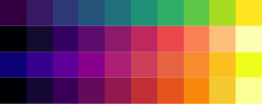
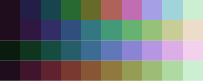
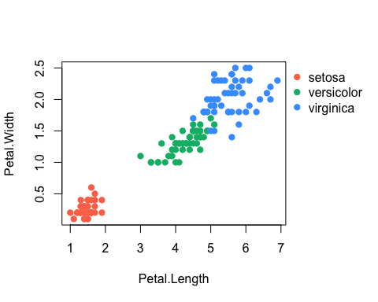
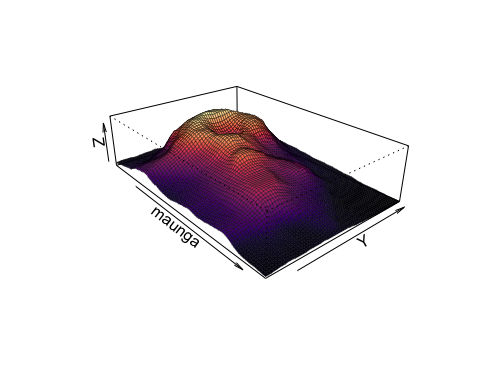
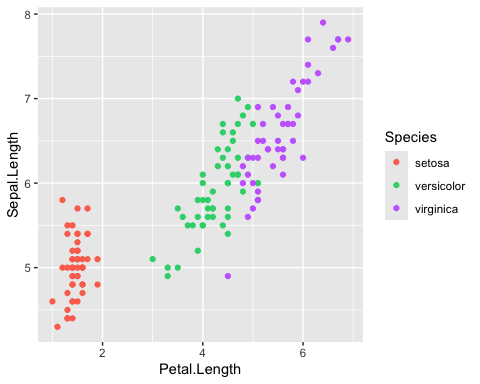
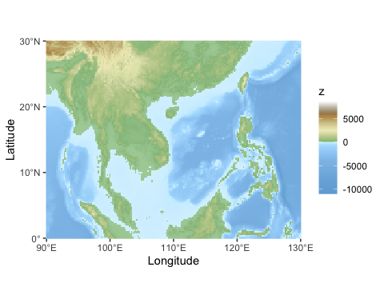

> [!NOTE]
> This fork of [jiho/chroma](https://github.com/jiho/chroma) contains
> changes to the documentation, examples and tests to pass `R CMD check`

# chroma

`chroma` is a [R](https://www.r-project.org) package for parsing and
formating colors in various specifications, manipulating colors, and
creating nice color scales and palettes. Much of the functionality is
based on the excellent [chroma.js](https://github.com/gka/chroma.js/)
javascript library by [Gregor Aisch](http://driven-by-data.net).

## Installation

`chroma` is not on CRAN yet. To get it from this page, install the
package `devtools` and

``` r
remotes::install_github("polettif/chroma")
library("chroma")
```

NB: some functions in the `chroma` package mask functions in basic R
packages (e.g. `grDevices`) or often used ones (e.g. `ggplot2`). Most of
the time, they are argument-compatible with the function they mask and,
if their result is different, I would argue that the one in chroma is
more correct. If you want to use chroma but would rather not mask the
other functions, just install the package but do not load it with
`library()`; instead, just call the functions with the `chroma::` prefix
(e.g. `chroma::rgb()` instead of `rgb()`, to avoid masking `rgb()` in
package `grDevices`).

## Color parsing

Parse colors in various specifications

``` r
rgb(r=0.5, g=0.5, b=0.5)
```

    # [1] "#808080"

``` r
ryb(r=0.5, y=0.5, b=0.5)
```

    # [1] "#957149"

``` r
hsv(h=120, s=0.5, v=0.5)
```

    # [1] "#408040"

``` r
hsl(h=120, s=0.5, l=0.5)
```

    # [1] "#40BF40"

``` r
hsi(h=120, s=0.5, i=0.5)
```

    # [1] "#40FF40"

``` r
hcl(h=120, c=0.5, l=0.5)
```

    # [1] "#638127"

``` r
lab(l=0.5, a=-0.5, b=0.2)
```

    # [1] "#008A53"

``` r
hex("#393939")
```

    # [1] "#393939"

``` r
hex("F39")
```

    # [1] "#FF3399"

``` r
css("rgb(100,100,100)")
```

    # [1] "#646464"

``` r
temperature(5600)
```

    # [1] "#FFEDE2"

``` r
wavelength(500)
```

    # [1] "#178672"

Parse directly from a matrix

``` r
x <- matrix(c(0.2, 0.5, 0.5, 0.5, 0.6, 0.4), ncol=3)
print(x)
```

    #      [,1] [,2] [,3]
    # [1,]  0.2  0.5  0.6
    # [2,]  0.5  0.5  0.4

``` r
rgb(x)
```

    # [1] "#338099" "#808066"

## Color formating

Convert back in various formats

``` r
as.rgb("coral1")
```

    #      r         g         b
    # [1,] 1 0.4470588 0.3372549

``` r
as.ryb("coral1")
```

    #             r        y          b
    # [1,] 0.424082 0.296286 0.08746012

``` r
as.hsv("coral1")
```

    #             h         s v
    # [1,] 9.940828 0.6627451 1

``` r
as.hsl("coral1")
```

    #             h s         l
    # [1,] 9.940828 1 0.6686275

``` r
as.hsi("coral1")
```

    #            h        s         i
    # [1,] 8.89147 0.432967 0.5947712

``` r
as.hcl("coral1")
```

    #             h         c         l
    # [1,] 38.74251 0.6651031 0.6494095

``` r
as.lab("coral1")
```

    #              l        a         b
    # [1,] 0.6494095 0.518758 0.4162358

``` r
as.hex("coral1")
```

    # [1] "#FF7256"

``` r
as.css("coral1")
```

    # [1] "RGB(255,114,86)"

``` r
as.temperature("coral1")
```

    # [1] 2686

``` r
as.wavelength("coral1")
```

    # [1] 616

## Color manipulation

Slightly modify a base color

``` r
col <- "#7BBBFE"
show_col(c(col, brighten(col), darken(col)))
```

<!-- -->

``` r
show_col(c(col, desaturate(col), saturate(col)))
```

<!-- -->

Make a color semi-transparent

``` r
col <- "#7BBBFE"
show_col(c(col, alpha(col), alpha(col, 0.2)))
```

<!-- -->

Mix or blend two colors

``` r
show_col(c("#7BBBFE", "#FDFF68", mix("#7BBBFE", "#FDFF68")))
```

<!-- -->

``` r
show_col(c("#7BBBFE", "#FDFF68", blend("#7BBBFE", "#FDFF68")))
```

<!-- -->

``` r
show_col(c("#7BBBFE", "#FDFF68", blend("#7BBBFE", "#FDFF68", mode="screen")))
```

<!-- -->

Compute the contrast between two colors

``` r
contrast("darkblue", "darkgreen")
```

    # [1] 2.056261

``` r
contrast("yellow", "darkgreen")
```

    # [1] 6.927705

Compute the Euclidean or perceptual distance between two colors
(following the CIE Delta E 2000 formula)

``` r
# pick three colors; lightgreen is closer to darkgreen that darkblue is
show_col(c("darkblue", "darkgreen", "lightgreen"))
```

<!-- -->

``` r
color_distance("darkblue", "darkgreen")
```

    # [1] 146.5474

``` r
color_distance("lightgreen", "darkgreen")
```

    # [1] 50.67107

``` r
CMClc("darkblue", "darkgreen")
```

    # [1] 81.42556

``` r
CMClc("lightgreen", "darkgreen")
```

    # [1] 35.98541

``` r
deltaE("darkblue", "darkgreen")
```

    # [1] 57.91349

``` r
deltaE("lightgreen", "darkgreen")
```

    # [1] 43.52127

which allows to find the closest perceived color in an array of
possibilities

``` r
target <- "limegreen"
choices <- rainbow(10)
closest_color <- choices[which.min(deltaE(target, choices))]
show_col(target, choices, closest_color)
```

<!-- -->

Extract or set a color channel

``` r
col <- "#7BBBFE"
channel(col, model="hcl", "h")
```

    #        h 
    # 266.7734

``` r
channel(col, model="hsv", "s")
```

    #        s 
    # 0.515748

``` r
channel(col, model="hsi", "i")
```

    #         i 
    # 0.7372549

``` r
channel(col, model="rgb", "r")
```

    #         r 
    # 0.4823529

``` r
col1 <- col2 <- col
channel(col1, model="hcl", "h") <- 120
channel(col2, model="hcl", "l") <- 1
show_col(c(col, col1, col2))
```

<!-- -->

Compute or set the perceived luminance of a color

``` r
luminance(c("red", "yellow", "darkblue"))
```

    # [1] 0.2126000 0.9278000 0.0186408

``` r
col1 <- col2 <- col <- "#7BBBFE"
luminance(col)
```

    # [1] 0.4690736

``` r
luminance(col1) <- 0.6
luminance(col2) <- 0.2
show_col(c(col, col1, col2))
```

<!-- -->

## Color scales and palettes

All scales and palettes are organised the same way:

- functions ending in `*_scale` return a *function* that takes a numeric
  vector `x` as argument and returns the corresponding colors in the
  scale.
- functions ending in `*_map` are shortcuts that build the scale, map
  the values, and return the colors.
- functions ending in `*_palette` return a *function* that takes an
  integer `n` as argument and returns `n` equally spaced colors along
  the scale.
- functions ending in `*_colors` are shortcut that create the palette
  and return the `n` colors.

``` r
x <- 0:10/10
s <- interp_scale()
s(x)
```

    #  [1] "#FFFFFF" "#E2E2E2" "#C6C6C6" "#ABABAB" "#919191" "#777777" "#5E5E5E"
    #  [8] "#474747" "#303030" "#1B1B1B" "#000000"

``` r
# or
interp_map(x)
```

    #  [1] "#FFFFFF" "#E2E2E2" "#C6C6C6" "#ABABAB" "#919191" "#777777" "#5E5E5E"
    #  [8] "#474747" "#303030" "#1B1B1B" "#000000"

``` r
n <- 11
p <- interp_palette()
p(n)
```

    #  [1] "#FFFFFF" "#E2E2E2" "#C6C6C6" "#ABABAB" "#919191" "#777777" "#5E5E5E"
    #  [8] "#474747" "#303030" "#1B1B1B" "#000000"

``` r
# or
interp_colors(n)
```

    #  [1] "#FFFFFF" "#E2E2E2" "#C6C6C6" "#ABABAB" "#919191" "#777777" "#5E5E5E"
    #  [8] "#474747" "#303030" "#1B1B1B" "#000000"

Palettes can be built by interpolating between colors

``` r
show_col(interp_colors(10))
```

<!-- -->

``` r
show_col(interp_colors(10, colors=c("#2D2B63", "#F7FF84")))
```

<!-- -->

``` r
show_col(interp_colors(10, colors=c("#2D2B63", "#FB3C44", "#F7FF84")))
```

<!-- -->

For the perception of “change” along the scale to be more linear, colors
can be interpolated using bezier curves and their lightness can be
corrected.

``` r
show_col(interp_colors(10, colors=c("#2D2B63", "#FB3C44", "#F7FF84")))
```

<!-- -->

``` r
show_col(interp_colors(10, colors=c("#2D2B63", "#FB3C44", "#F7FF84"), interp="bezier"))
```

<!-- -->

``` r
show_col(interp_colors(10, colors=c("#2D2B63", "#FB3C44", "#F7FF84"), interp="bezier", correct.lightness=TRUE))
```

<!-- -->

Preset palettes are available, from colorbrewer

``` r
show_col(lapply(brewer_info$name, function(x) {brewer_colors(n=7, name=x)}))
```

<!-- -->

Or viridis

``` r
show_col(
  viridis_colors(10),
  magma_colors(10),
  plasma_colors(10),
  inferno_colors(10)
)
```

<!-- -->

Or cubehelix

``` r
show_col(
  cubehelix_colors(10),
  cubehelix_colors(10, h=300, rot=-0.75),
  cubehelix_colors(10, h=120, rot=0.5),
  cubehelix_colors(10, h=300, rot=0.5)
)
```

<!-- -->

Or ETOPO1 and Wikipedia for topographical maps

``` r
show_col(
  etopo_colors(100),
  wikitopo_colors(100)
)
```

<!-- -->

Custom, perceptually appropriate, palettes can be built in HCL space,
for either discrete

``` r
show_col(hue_colors(10))
```

<!-- -->

or continuous variables

``` r
show_col(chroma_colors(10, h=140))
```

<!-- -->

``` r
show_col(light_colors(10, h=140))
```

<!-- -->

## Helper functions

Additional functions are included to facilitate the use of the color
scales in base and ggplot2 plots.

`sidemargin()` and `sidelegend()` allow to place legends on the side of
base plots

``` r
attach(iris)
# make larger right margin
pars <- sidemargin()
# plot the data with a nice color scale
plot(Petal.Length, Petal.Width, col=hue_map(Species), pch=19)
# add a legend for the scale on the side
sidelegend(legend=levels(Species), col=hue_colors(nlevels(Species)), pch=19)
```

<!-- -->

``` r
# set graphical parameters back to default
par(pars)
detach(iris)
```

`persp_facets()` allows to compute the colors for each facet of a
`persp()` plot

``` r
persp(maunga, theta=50, phi=25, scale=FALSE, expand=2,
      border=alpha("black", 0.4),
      col=magma_map(persp_facets(maunga$z)))
```

<!-- -->

Various `scale_color_*()` and `scale_fill_*()` functions allow to use
the color scales defined in chroma directly with ggplots and
`scale_xy_map()` draws nice `x` and `y` scales for maps.

``` r
ggplot(iris) +
  geom_point(aes(Petal.Length, Sepal.Length, color=Species)) +
  scale_color_cubehelix_d(h=0, rot=0.75, c=1, l=c(0.6, 0.6))
```

<!-- -->

``` r
ggplot(thaixyz) + coord_quickmap() +
 geom_raster(aes(x, y, fill=z)) +
 scale_fill_wikitopo() + scale_xy_map()
```

<!-- -->

------------------------------------------------------------------------

Happy coloring!
